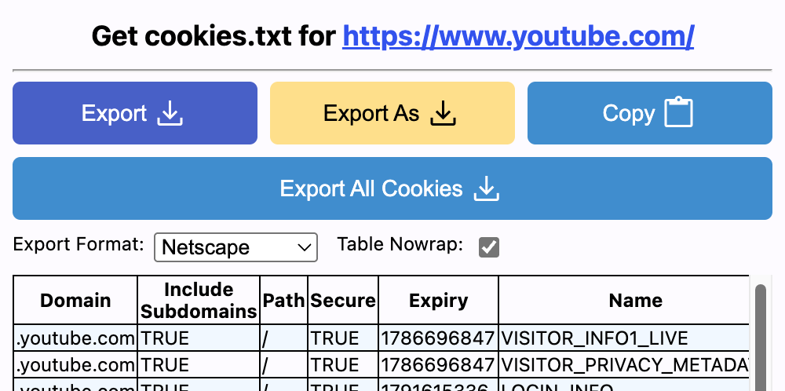

# Setup
```
conda create -n pt2.7 python=3.11.9 -y
python -m pip install --upgrade setuptools pip
pip install torch==2.7.0 torchvision torchaudio --index-url https://download.pytorch.org/whl/cu126
pip install -U xformers==0.0.30 --index-url https://download.pytorch.org/whl/cu126 --no-deps
```

# Prepare
1. Install [Get cookies.txt LOCALLY](https://chromewebstore.google.com/detail/get-cookiestxt-locally/cclelndahbckbenkjhflpdbgdldlbecc) extension for Chrome or Edge.
2. Go to [www.youtube.com](www.youtube.com) and login.
3. Click on the `Export` on the extention to download a `www.youtube.com_cookies.txt` file, and put it in the code repo.
   
4. Set environment variable `TED1k_ROOT` to your dataset root. The whole process will occupy 100GB.


